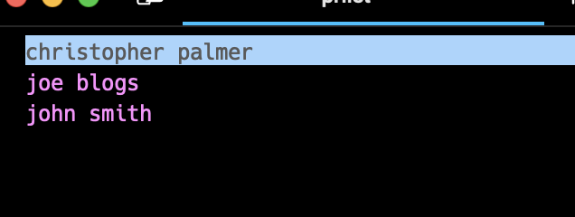

# Chris's work utils

A bunch of miscellanious utils for doing stuff that I (Chris) like (primarily bitbucket).

## Requirements

- Mac
- Asdf

## Getting Started

```sh
git clone https://github.com/chrisjpalmer/chris-utils ~/scripts
cd ~/scripts
asdf install
npm install
```

Add the following to your `~/.zshrc` or `~/.bashrc`:

```sh
export PATH=$HOME/scripts/bin:$PATH
```

## Configure

To configure the scripts, you need to copy the config template and fill it in.
You will need to generate a bitbucket app password with the scopes:

- `repositories:read`
- `pullrequests:read`
- `workspacemembership:read`

```sh
cd ~/scripts
cp config.yaml.template config.yaml
```

## Available Commands

### `prlist` - lists bitbucket prs you are reviewing

```sh
> prlist

christopher palmer -------------------------------
	Fix processor issue - https://bitbucket.org/xxx/repo-name/pull-requests/1 - ✅✅ - [ 👍 3 ]
	Add support for multiline processing - https://bitbucket.org/xxx/repo-name/pull-requests/2 - ✅✅✅🔄 - [ ❗ 1 ]
	Migrate to postgres 16 - https://bitbucket.org/xxx/repo-name/pull-requests/3 - ✅❌ - [ 🎉 1 ]

john smith -------------------------------
	Add test for browser automation - https://bitbucket.org/xxx/repo-name/pull-requests/4 - ✅✅ - [ 🎉 3 ]

joe blogs -------------------------------
	Apply linting rules - https://bitbucket.org/xxx/repo-name/pull-requests/5 - ✅✅ - [ ❗ 1 ]
```

#### Flags

- `--user|-u christopher palmer, joe blogs` - get the prs for the users specified (comma seperated list accepted)
- `--only-master|--only-main|-m` - only get prs pointing to master/main (prlist automatically picks master or main based on the repo)
- `--choose|-c` - opens a switcher where you can pick a team mate from the list. 

#### CI Check Key

- ✅ a CI check passed
- 🔄 a CI check is in progress
- ❌ a CI check failed

#### Approvals Key

- 🎉 you have approved it
- 👍 you have not approved it AND > 2 approvals
- ❗ you have not approved it AND < 2 approvals

#### Examples

- `✅✅ - [ 👍 3 ]` indicates 2 CI checks have passed, you haven't approved it, there are 3 approvals on it.
- `✅❌ - [ 🎉 1 ]` indicates 1 CI check passed, 1 CI check failed, you have approved it, you are the only approver (hence the 1).

#### Configure Teammates

Add team mates to the `config.yaml` file. 
Also add `me: <your name>` to allow `prlist` to filter out PRs which you aren't reviewing.

```yaml
me: christopher palmer
team:
  - christopher palmer
  - john smith
  - joe blogs
```

#### Select specific team mate

```sh
> prlist -c
```



#### Get specific team mates

```sh
> prlist -u christopher palmer, joe blogs

christopher palmer -------------------------------
	Fix processor issue - https://bitbucket.org/xxx/repo-name/pull-requests/1 - ✅✅ - [ 👍 3 ]
	Add support for multiline processing - https://bitbucket.org/xxx/repo-name/pull-requests/2 - ✅✅✅🔄 - [ ❗ 1 ]
	Migrate to postgres 16 - https://bitbucket.org/xxx/repo-name/pull-requests/3 - ✅❌ - [ 🎉 1 ]

joe blogs -------------------------------
	Apply linting rules - https://bitbucket.org/xxx/repo-name/pull-requests/5 - ✅✅ - [ ❗ 1 ]
```

#### Get PRs only pointing to master/main

```sh
> prlist -m -u christopher palmer

christopher palmer -------------------------------
	Fix processor issue - https://bitbucket.org/xxx/repo-name/pull-requests/1 - ✅✅ - [ 👍 3 ]
```

### `alpha` - allows you to sort tokens in alphabetical order

```sh
> alpha
Enter the tokens for alphabetical ordering:

> night
> message
> 

message
night
```

### `prs` - fetches pr urls from a list of branches

***Requires connection to bitbucket***

```sh
> cd my-git-repo
> prs "branch-a
 branch-b"

Do an A thing - https://bitbucket.org/xxx/my-repo/pull-requests/1
Do a B thing - https://bitbucket.org/xxx/my-repo/pull-requests/2
copied to clipboard!
```

You can go to slack and paste the links there to spam your team mates with PRs.

### `body` - copies the body of your commit message

```sh
> cd my-git-repo
> body

copied!
```

Line wrapping is removed so it will look natural when pasting into the description of a PR.

### `subject` - copies the subject line of your commit message

```sh
> cd my-git-repo
> subject

copied!
```

### `rebase` - provides commands to rebase a chain of branches

***requires the following alias***

```zsh
alias forcepush="git push -f"
```

When working with pr chains you may have a setup like so:

```
branch b -> branch a -> master
```

If you make a change to master, how can you quickly rebase all those branches?

```sh
> cd my-git-repo
> rebase "master
 branch-a
 branch-b"

git checkout branch-a && git rebase -i master
git checkout branch-b && git rebase -i branch-a
 
forcepush origin branch-a
forcepush origin branch-b
```

Copy and paste the commands into the terminal.


